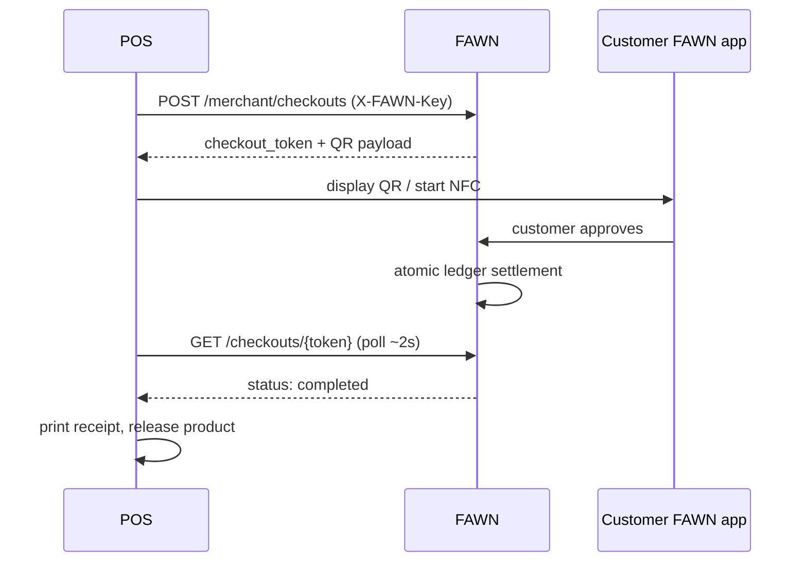

# FAWN Merchant Integration — Live in Under a Day

Two integration paths. Pick based on what the dispensary already runs.

| Path | Effort | Use when |
|---|---|---|
| **A. Hosted widget** | ~30 min | Online menu / any website / self-serve kiosk |
| **B. Server API** | ~2–4 hrs | POS integration, custom register flow |
| C. NFC phone tap | already built | In-store contactless (mobile app) |

**Recommend Path A first, always.** Get them live today; deepen later.

---

## Prerequisites

1. Merchant account: `POST /closed-loop/merchants`
2. KYB submitted: `POST /merchant/kyb` → `POST /merchant/kyb/submit`
3. API key: `POST /merchant/api-keys?mode=test` (test keys work **immediately** —
   your developer builds while KYB is in review)

`BASE = https://web-production-13d5b.up.railway.app`

---

## 🔑 Security rule (read once, follow always)

**`fawn_sk_*` keys are server-side only.** Never in HTML, JS, mobile apps, or
git. A leaked key lets anyone create charges on your account.

The widget never sees your key: your server creates the checkout and passes
only the short-lived `checkout_token` to the browser.

Revoke instantly: `DELETE /merchant/api-keys/{id}`

---

## Path A — Hosted widget (30 minutes)

### Step 1 — Server: create the checkout

```bash
curl -X POST "$BASE/closed-loop/merchant/checkouts" \
  -H "X-FAWN-Key: fawn_sk_test_xxx" \
  -H "Content-Type: application/json" \
  -d '{"amount_cents": 6000, "order_reference": "TICKET-1234"}'
```

```json
{ "checkout_token": "chk_abc123", "amount_cents": 6000,
  "user_fee_cents": 1, "merchant_fee_cents": 1,
  "payer_total_cents": 6001, "status": "open", "expires_at": "..." }
```

<details><summary>Node.js</summary>

```js
const res = await fetch(`${BASE}/closed-loop/merchant/checkouts`, {
  method: 'POST',
  headers: { 'X-FAWN-Key': process.env.FAWN_SECRET_KEY, 'Content-Type': 'application/json' },
  body: JSON.stringify({ amount_cents: 6000, order_reference: orderId })
});
const { checkout_token } = await res.json();
// pass ONLY checkout_token to the browser
```
</details>

<details><summary>Python</summary>

```python
import os, requests
r = requests.post(f"{BASE}/closed-loop/merchant/checkouts",
    headers={"X-FAWN-Key": os.environ["FAWN_SECRET_KEY"]},
    json={"amount_cents": 6000, "order_reference": order_id}, timeout=15)
checkout_token = r.json()["checkout_token"]
```
</details>

### Step 2 — Browser: mount the widget

```html
<script src="https://web-production-13d5b.up.railway.app/static/fawn-checkout.js"></script>
<div id="fawn-pay"></div>
<script>
  FAWN.mount('#fawn-pay', {
    checkoutToken: 'chk_abc123',          // from your server
    onPaid:   r  => window.location = '/thanks?order=' + r.id,
    onCancel: () => console.log('cancelled'),
    onError:  e  => console.warn('network hiccup', e)
  });
</script>
```

The widget renders the amount, a Pay button, a QR code, and polls status until
paid/cancelled/expired. **Done.**

### Step 3 — Confirm server-side before releasing product ⚠️

Never trust the browser callback alone:

```bash
curl "$BASE/closed-loop/checkouts/chk_abc123"
# release goods only when {"status":"completed"}
```

---

## Path B — Server API (POS integration)



**Polling:** every 2s, stop at `completed` / `cancelled` / `expired`, and give
up after the expiry timestamp. Always re-check server-side before releasing product.

**Idempotency:** pass a stable `order_reference`; never create a second
checkout for the same ticket on retry — look up the existing one.

---

## Path C — In-store NFC tap

Already implemented end-to-end (`/nfc-challenge` → `/nfc-authorize`, ECDSA
device-signed, single-use challenges, replay-rejected). Requires the FAWN
mobile app on an NFC-capable Android device as the terminal. See
`fawn-mobile/README.md` for the two-phone test procedure.

---

## Testing

| Mode | Key | Behavior |
|---|---|---|
| `test` | `fawn_sk_test_…` | Available immediately; safe to develop against |
| `live` | `fawn_sk_live_…` | Requires **verified KYB** + active merchant + unexpired license |

Test checklist:
- [ ] Create checkout → correct `payer_total_cents` (amount + $0.01)
- [ ] Widget renders and polls
- [ ] Paid → server-side status is `completed`
- [ ] Expired checkout handled
- [ ] Network drop mid-poll → widget reconnects, doesn't double-charge
- [ ] Revoked key → 401

---

## Errors

| Code | Meaning | Fix |
|---|---|---|
| 401 | Missing/invalid/revoked `X-FAWN-Key` | Check header; mint a new key |
| 403 | Merchant not active | Await approval |
| 409 | Live key without verified KYB | Use a test key until verified |
| 422 | Bad amount / expired license | Check payload; renew license |
| 429 | Rate limited | Exponential backoff |

---

## Going live

1. KYB `verified` (human review — cannabis is never auto-approved)
2. Merchant status `active`
3. Mint a **live** key; swap the env var
4. Configure settlement: `PUT /merchant/settlement`
5. Run one real $1 transaction end-to-end before opening to customers

**Reminder:** payments are final — no chargebacks. Refunds are the merchant's
own process. Make sure staff know this before day one.
