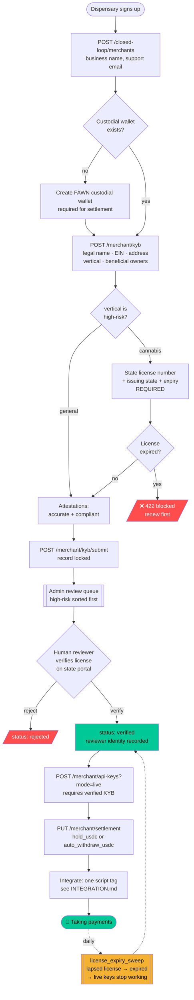

# FAWN Merchant Onboarding — Index

Everything needed to onboard merchants (dispensaries first) onto FAWN's
closed-loop payment network.

| Doc | What's in it |
|---|---|
| **[COMPLIANCE.md](COMPLIANCE.md)** | Legal path, state ranking, cost/speed checklist. **Read first.** |
| **[SETTLEMENT.md](SETTLEMENT.md)** | Settlement architecture + per-transaction cost model |
| **[INTEGRATION.md](INTEGRATION.md)** | Developer guide — merchant live in under a day |
| **[PITCH.md](PITCH.md)** | Merchant one-pager + acquisition playbook + target list |

## Three things to know up front

1. **Stripe is not usable for cannabis** and FAWN has no Issuing/Treasury
   stack anyway. FAWN's own closed-loop rail is the product. (COMPLIANCE §0.1)
2. **FAWN's P2P transfers break the closed-loop exemption.** The fix is the
   agent-of-payee structure. This needs counsel. (COMPLIANCE §0.2)
3. **The merchant's USDC→USD off-ramp is the real bottleneck** and code can't
   fix it. Qualify merchants who already have MRB banking. (COMPLIANCE §0.3)

---

## Onboarding flow



### Why it's shaped this way

- **No auto-approval for high-risk verticals.** A dispensary reaches
  `verified` only through an explicit human decision, and the reviewer's
  identity is written to the audit log.
- **Licenses expire.** Verification is point-in-time; the daily sweep
  demotes lapsed merchants so an approved-once dispensary can't keep
  transacting on a dead license.
- **Test keys before verification, live keys after.** A merchant's developer
  can build the integration on day one while KYB is still in review — removing
  the usual "wait two weeks then start integrating" delay.

---

## API surface

### Merchant onboarding (this module — new)
| Method | Path | Auth | Purpose |
|---|---|---|---|
| POST | `/merchant/kyb` | user JWT | Create/update KYB (editable until submitted) |
| GET | `/merchant/kyb` | user JWT | Status + `can_transact` |
| POST | `/merchant/kyb/submit` | user JWT | Lock and submit for review |
| GET | `/merchant/api-keys` | user JWT | List keys (never returns secrets) |
| POST | `/merchant/api-keys` | user JWT | Mint key — plaintext returned **once** |
| DELETE | `/merchant/api-keys/{id}` | user JWT | Revoke |
| GET/PUT | `/merchant/settlement` | user JWT | Payout configuration |
| GET | `/merchant/admin/review-queue` | admin key | Pending KYB, high-risk first |
| POST | `/merchant/admin/kyb/{id}/decide` | admin key | Verify / reject |

### Payment acceptance (existing — `closed_loop.py`)
| Method | Path | Purpose |
|---|---|---|
| POST | `/closed-loop/merchants` | Create merchant account |
| POST | `/closed-loop/merchant/checkouts` | Create a checkout |
| GET | `/closed-loop/checkouts/{token}` | Public checkout status (widget polls this) |
| POST | `/closed-loop/merchant/checkouts/{token}/nfc-challenge` | Begin NFC tap |
| POST | `/closed-loop/merchant/checkouts/{token}/nfc-authorize` | Complete tap |
| GET | `/closed-loop/merchant/checkouts` | Merchant's checkout history |

---

## Files

```
models_merchant.py                  KYB, API keys, settlement models
routers/merchant_onboarding.py      endpoints + license_expiry_sweep()
tests/test_merchant_onboarding.py   12 tests (compliance gates included)
static/fawn-checkout.js             drop-in merchant widget
docs/merchant/                      this documentation
```

## Not built (deliberately)

| Gap | Why |
|---|---|
| Auto-withdraw **execution** | Config is stored; the on-chain job isn't wired. Needs a funded gas station. |
| Fiat/bank payout for MRBs | Requires MRB-friendly banking FAWN doesn't have. Shipping a stub would imply a capability that doesn't exist. |
| Automated license verification | State portals lack usable APIs; verification is manual and recorded. |
| Merchant dashboard UI | API-complete; the web surface is next. |

## Before going live — operator checklist

- [ ] Counsel sign-off on agent-of-payee ⚖️ (COMPLIANCE §0.2)
- [ ] Merchant agreement with agent-of-payee language ⚖️
- [ ] Fund the gas station wallet `0x2284EeDD0b2Ec4A44F5Ec154ca535ED3BA35dcA6` (POL)
- [ ] Confirm merchant has MRB-friendly banking
- [ ] Manually verify the state license on the issuing state's portal
- [ ] Set `ADMIN_API_KEY` reviewer process + name the human reviewer
