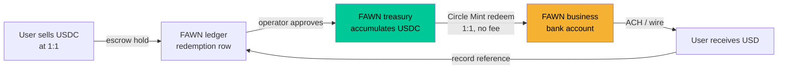

# Stablecoin Redemption — Selling USDC Back to FAWN at 1:1

**Goal:** users and merchants cash out of USDC into USD without Stripe, by
selling their stablecoin back to FAWN at exactly 1:1.

**Status:** ledger, escrow, and approval workflow are **built and live**. Fiat
movement is **not** automated — an operator pays through a real rail and
records the reference. `redemptions_enabled` defaults to **False**.

---

## 1. The thing to be clear-eyed about

Dropping Stripe removes a *vendor*, not the *requirements*.

**a) You still need a bank.** USD has to leave some account. "Independent of
Stripe" ≠ "independent of banking." The realistic rails are ACH from a business
bank account, wire, or a BaaS partner — all of which need a bank relationship.

**b) This makes FAWN's regulatory footprint bigger, not smaller.** Under FinCEN
guidance, a business that buys and sells convertible virtual currency for fiat
is an **exchanger** — a money services business, with FinCEN MSB registration
and, in most states, money transmitter licensing. Previously FAWN could argue it
was a customer of a licensed processor. Buying USDC as principal removes that
argument. ⚖️ **Get counsel before enabling this.**

**c) You need real USD float.** To honor 1:1 you must hold dollars. Every
approved redemption is a hard obligation. `redemption_float_cents` exists so
FAWN cannot accept more obligations than it can actually pay.

None of this means don't do it. It means do it deliberately.

---

## 2. Where the dollars actually come from

FAWN receives USDC and must produce USD. Three realistic paths:

| Path | How | Cost | Speed | Notes |
|---|---|---|---|---|
| **Circle Mint** (recommended) | Circle Business Account redeems USDC → USD at **exactly 1:1, no fee**, wired to your bank | Free redemption; bank wire fees | 1–2 business days | The only true 1:1 rail. Requires Circle account + business bank + KYB |
| **Exchange desk** | Sell USDC on Coinbase/Kraken, withdraw USD | ~0–0.5% spread/fees | 1–3 days | Introduces a spread you'd be absorbing |
| **OTC desk** | Negotiated block conversion | Negotiated | Same/next day | Only sensible at volume |

**Circle Mint is the answer that makes 1:1 economically honest** — anything with
a spread means FAWN eats the difference on every redemption.



⚠️ **Cannabis caveat:** if the seller is a dispensary, FAWN is now converting
marijuana-related funds and needs **MRB-friendly banking of its own**. This
moves the hardest problem from the merchant onto FAWN. Do not enable merchant
redemption for MRBs until that banking exists. (See `COMPLIANCE.md` §0.3.)

---

## 3. What's built

### Lifecycle

```
requested ──approve──> approved ──mark-paid──> paid        (hold consumed)
    │                      │
    ├──cancel (user)───────┤
    ├──reject (admin)──────┤
    └──mark-failed (admin)─┘  ──> refunded, hold released
```

### Money-safety invariants (all test-covered)

| Invariant | Why it matters |
|---|---|
| USDC debited at **request** time, held on the row | A pending redemption can't be double-spent |
| Refund releases **exactly** `held_cents`, then zeroes it | A repeated cancel/reject can't credit twice |
| `payout_cents == usdc_cents` — **DB CHECK constraint** | A future code change cannot silently add a spread |
| `with_for_update()` on user + redemption rows | Concurrent requests can't race the balance |
| Idempotency key | A double-submitted request creates one redemption |
| Float capacity check | FAWN can't promise more dollars than it holds |
| Per-request min/max + rolling 24h per-user cap | Bounds blast radius |
| `redemptions_enabled=False` default | Cannot be switched on by accident |

### API

| Method | Path | Auth | Purpose |
|---|---|---|---|
| GET | `/redemptions/quote?amount_cents=` | user | Preview eligibility, creates nothing |
| POST | `/redemptions` | user | Request; escrows the USDC |
| GET | `/redemptions` | user | My redemptions |
| POST | `/redemptions/{id}/cancel` | user | Cancel while pending → refund |
| GET | `/redemptions/admin/queue` | admin | Open requests + total obligation |
| POST | `/redemptions/admin/{id}/approve` | admin | Accept the obligation |
| POST | `/redemptions/admin/{id}/reject` | admin | Decline → refund |
| POST | `/redemptions/admin/{id}/mark-paid` | admin | Record USD sent (bookkeeping) |
| POST | `/redemptions/admin/{id}/mark-failed` | admin | Payment bounced → refund |

**`mark-paid` does not send money.** It records that an operator already did.
That separation is deliberate: an endpoint that *looked* like it paid people
while silently doing nothing would be far more dangerous than one that's
honestly manual.

### Config (env)

| Setting | Default | Meaning |
|---|---|---|
| `REDEMPTIONS_ENABLED` | `false` | Master switch |
| `REDEMPTION_MIN_CENTS` | `500` | $5.00 floor |
| `REDEMPTION_MAX_CENTS` | `100000` | $1,000 per request |
| `REDEMPTION_DAILY_MAX_CENTS` | `250000` | $2,500 per user / 24h |
| `REDEMPTION_FLOAT_CENTS` | `0` | USD FAWN can honor. `0` = unlimited (**dev only**) |

---

## 4. Daily operator runbook

1. `GET /redemptions/admin/queue` — review open requests and total obligation.
2. Sanity-check each: is the destination plausible, the user known, the amount
   consistent with their activity?
3. `approve` the good ones (`reject` the rest — funds auto-refund).
4. Redeem accumulated USDC → USD via Circle Mint into the business bank account.
5. Send each user their dollars (ACH/wire).
6. `mark-paid` with the real trace/reference from step 5.
7. If a payment bounces, `mark-failed` — the user is made whole automatically.

**Before enabling in production:**
- [ ] Counsel sign-off on MSB / money-transmitter posture ⚖️
- [ ] FinCEN MSB registration if required ⚖️
- [ ] Circle Mint (or equivalent) account live
- [ ] Business bank account that can send ACH/wire
- [ ] `REDEMPTION_FLOAT_CENTS` set to real available USD (**never leave at 0**)
- [ ] Named operator owning the daily runbook
- [ ] Then set `REDEMPTIONS_ENABLED=true`

---

## 5. Not built (deliberately)

| Gap | Why |
|---|---|
| Automated ACH/wire execution | Needs a bank/BaaS integration that doesn't exist. A stub would imply FAWN can pay people when it can't. |
| Circle Mint API integration | Sensible next step once a Circle account exists |
| Bank account collection | Only a display label is stored. Full bank credentials shouldn't live in FAWN's DB without a clear need and matching controls. |
| Automatic approval | Every redemption is a real dollar obligation — a human decides |
