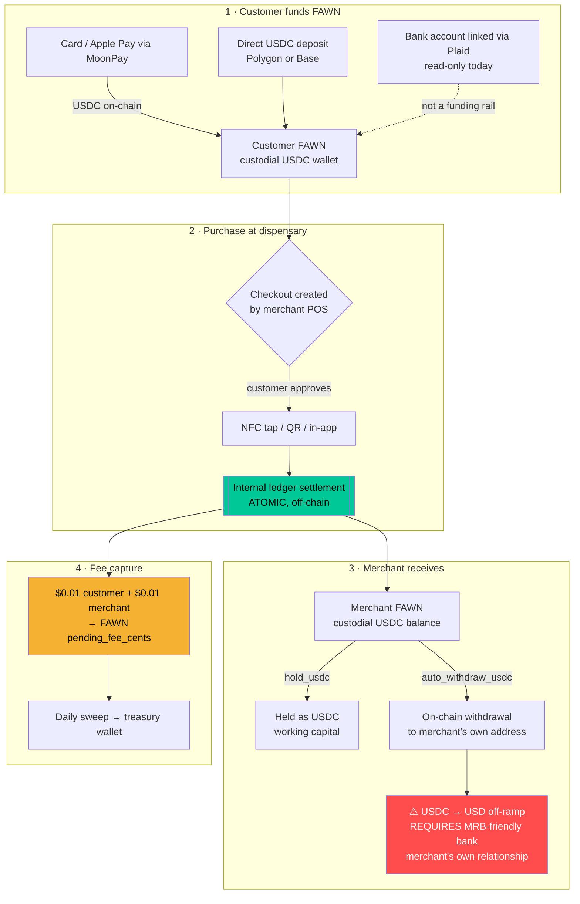

# FAWN Stablecoin Settlement Architecture & Cost Model

**Date:** 2026-08 · Companion to `COMPLIANCE.md`

---

## 1. End-to-end flow

**The critical design point:** step 2→3 is an **internal ledger move**, not an
on-chain transaction. Both parties hold FAWN custodial balances, so settlement
is a single atomic database transaction — instant, final, and costing FAWN
essentially nothing. On-chain gas is incurred only when a merchant *withdraws*
(step 3→X), which is amortized across thousands of sales.

This is why FAWN can charge $0.01 where card-based competitors cannot: there
is no interchange, no card network, and no per-transaction blockchain fee.

---

## 2. Per-transaction cost breakdown

**Live inputs (2026-08):** POL ≈ $0.0772 · ETH ≈ $1,877 · ERC-20 transfer ≈ 65,000 gas

### 2.1 The sale itself (internal settlement)

| Component | Cost |
|---|---|
| Blockchain gas | **$0.00** — no on-chain tx |
| Database write (Postgres row updates + audit) | < $0.000001 |
| **Total marginal cost per sale** | **≈ $0.00** |
| **Revenue per sale** | **$0.02** ($0.01 customer + $0.01 merchant) |

### 2.2 Merchant withdrawal (amortized)

| Chain | Gas price | Native cost | USD | Per-sale if 1 withdrawal / 200 sales |
|---|---|---|---|---|
| **Polygon** | 30 gwei | 0.00195 POL | **$0.00015** | $0.0000008 |
| **Polygon** | 100 gwei (congested) | 0.0065 POL | **$0.00050** | $0.0000025 |
| **Base** | 0.02 gwei + L1 data | ~0.0000013 ETH | **~$0.0024** | $0.000012 |

> Gas prices are documented typical ranges — public RPCs rate-limited the live
> query at time of writing. Token prices are live. Recompute before quoting
> externally; the endpoint `/status/gas-station` reports live wallet balances.

**Cheapest rail: native USDC on Polygon.** Base is a fine second (and FAWN
already monitors both). Even at 100 gwei, withdrawal cost is ~1/20th of a
single $0.01 fee.

### 2.3 Margin conclusion

Gross margin per transaction is effectively **100%** ($0.02 revenue, ~$0
marginal cost). The $0.01 model is *not* undermined by settlement mechanics.

**But be honest about scale.** Fixed costs, not per-transaction costs, are what
matter:

| Monthly transactions | Revenue @ $0.02 | Covers |
|---|---|---|
| 10,000 | $200 | Hosting only |
| 100,000 | $2,000 | Hosting + RPC + basic tooling |
| 500,000 | $10,000 | Above + part-time compliance officer |
| 2,000,000 | $40,000 | Above + full BSA/AML program |

A busy dispensary runs ~3,000–9,000 transactions/month. So **~15–35 active
dispensaries** gets you to $2,000/mo; **~60–160** to $10,000/mo.

**Strategic read:** at $0.01, pricing is a *customer-acquisition weapon*, not a
near-term profit engine. It buys the beachhead. Real monetization comes from
volume, float, and adjacent products (payroll, lending, the consumer app).
Say this plainly to investors rather than implying $0.01 scales into margin
on its own — the credibility is worth more than the optimism.

---

## 3. Why this beats what dispensaries use today

| Method | Cost on a $60 basket | Legal risk |
|---|---|---|
| Cash | "Free" + theft, armored car, counting labor | Low, but high shrink |
| Cashless ATM / point-of-banking | $3.00–$3.50 flat, passed to customer | **High** — network misrepresentation |
| Aeropay (pay-by-bank) | 2.5% + $0.25 ≈ **$1.75** | Low |
| Debit / PIN debit | ~$2.00+ | Medium |
| **FAWN** | **$0.01** (merchant) + $0.01 (customer) | Low *if* agent-of-payee holds ⚖️ |

FAWN is **~175× cheaper than Aeropay** on a typical basket. That is the pitch.

---

## 4. Honest risks

1. **Off-ramp dependency (biggest).** The merchant still needs USD. FAWN does
   not and cannot provide MRB banking. Qualify for an existing MRB bank in
   outreach.
2. **Customer funding friction.** Customers must already hold USDC in FAWN.
   MoonPay card purchase works, but a dispensary customer won't do that at the
   register — **onboarding must happen before the customer is in line.** This
   is the single hardest consumer-side problem, and it is a marketing problem,
   not a technical one.
3. **Two-sided cold start.** Empty-wallet customers + empty-network merchants.
   The PayPal answer is a dense beachhead — see `PITCH.md`.
4. **USDC depeg.** Balances are USDC-denominated. A depeg is a real (if
   unlikely) tail risk to merchant receivables.
5. **Chain congestion.** Withdrawals get pricier under load; the
   `min_payout_cents` floor ($250 default) prevents uneconomic withdrawals.
6. **Regulatory reversal.** If counsel rejects agent-of-payee in a state, that
   state requires an MTL before launch. Non-negotiable.

---

## 5. Implementation status

| Piece | Status |
|---|---|
| Customer custodial USDC wallets | ✅ live |
| Merchant accounts + approval | ✅ live (`closed_loop.py`) |
| Checkout + NFC tap authorize | ✅ live |
| Atomic internal settlement | ✅ live |
| $0.01/$0.01 fee capture | ✅ live |
| Daily fee sweep → treasury | ✅ live (scheduler ON) |
| Merchant KYB + license gating | ✅ **new** (`merchant_onboarding.py`) |
| Merchant API keys | ✅ **new** |
| Settlement config (hold / auto-withdraw) | ✅ **new** (config surface) |
| Auto-withdraw execution job | ⬜ not built — config is stored, execution is not wired |
| Fiat/bank payout for MRBs | ❌ **out of scope by design** (§4.1) |

⚠️ **Gas station must be funded** before any on-chain withdrawal works:
`0x2284EeDD0b2Ec4A44F5Ec154ca535ED3BA35dcA6` (POL on Polygon). Currently $0.
